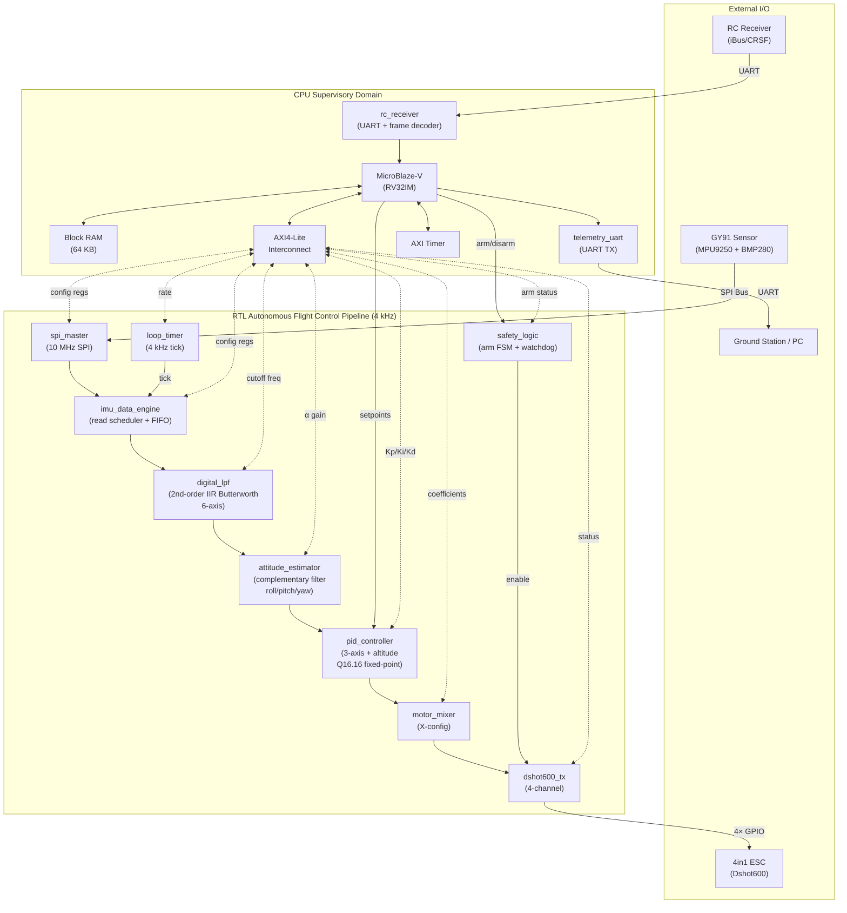

# FPGA Quadcopter Flight Controller — RTL Architecture

## Target Platform
- **FPGA**: Xilinx CMOD A7-35T (Artix-7 XC7A35T-1CPG236C)
- **System Clock**: 100 MHz (on-board oscillator)
- **Sensors**: GY91 10DOF (MPU9250 + BMP280) via SPI
- **RC Receiver**: iBus / CRSF compatible (UART)
- **Motor Drive**: 4in1 ESC, Dshot600 protocol
- **CPU**: MicroBlaze-V (RV32IM) — supervisory only

---

## 1. Mermaid Block Diagram



---

## 2. ASCII Block Diagram

```
┌──────────────────────────────────────────────────────────────────────────────────────────────┐
│                         FPGA FLIGHT CONTROLLER (XC7A35T @ 100 MHz)                           │
├──────────────────────────────────────────────────────────────────────────────────────────────┤
│                                                                                              │
│  ┌────────────────────────────────────────────────────────────────────────────────────────┐  │
│  │                  RTL AUTONOMOUS PIPELINE (4 kHz, deterministic)                        │  │
│  │                                                                                        │  │
│  │   ┌───────────┐    ┌───────────────┐    ┌────────────┐    ┌───────────────────┐       │  │
│  │   │ spi_master│───►│imu_data_engine│───►│ digital_lpf│───►│attitude_estimator │       │  │
│  │   │ (10 MHz)  │    │(auto-schedule)│    │(IIR biquad)│    │(complementary flt)│       │  │
│  │   └─────┬─────┘    └───────────────┘    │ 6-axis     │    │roll/pitch/yaw     │       │  │
│  │         │ SPI                            └────────────┘    └────────┬──────────┘       │  │
│  │         │                                                           │                  │  │
│  │   ┌─────┴─────┐                          ┌────────────┐    ┌───────▼──────────┐       │  │
│  │   │  GY91     │      ┌──────────┐        │loop_timer  │    │  pid_controller  │       │  │
│  │   │MPU9250    │      │  safety  │        │ (4 kHz)    │    │ (3-axis + alt)   │       │  │
│  │   │+ BMP280   │      │  _logic  │        └──────┬─────┘    │  Q16.16 fixed-pt │       │  │
│  │   └───────────┘      │(arm FSM) │               │ tick     └───────┬──────────┘       │  │
│  │                       └────┬─────┘               │                  │                  │  │
│  │                            │ enable              │          ┌───────▼──────────┐       │  │
│  │                       ┌────▼──────────┐          │          │  motor_mixer     │       │  │
│  │                       │  dshot600_tx  │◄─────────┘          │  (X-config)      │       │  │
│  │                       │  (4-channel)  │◄────────────────────┘                  │       │  │
│  │                       └──────┬────────┘                                        │       │  │
│  │                              │ 4× GPIO                                         │       │  │
│  └──────────────────────────────┼─────────────────────────────────────────────────┘       │  │
│                                 │                                                         │  │
│                                 ▼                                                         │  │
│                          ┌─────────────┐                                                  │  │
│                          │  4in1 ESC   │                                                  │  │
│                          │ (Dshot600)  │                                                  │  │
│                          └─────────────┘                                                  │  │
│                                                                                           │  │
│  ┌────────────────────────────────────────────────────────────────────────────────────┐   │  │
│  │                  CPU SUPERVISORY DOMAIN (non-real-time)                             │   │  │
│  │                                                                                    │   │  │
│  │   ┌──────────────┐     ┌───────────────────┐     ┌──────────────┐                 │   │  │
│  │   │ MicroBlaze-V │◄───►│ AXI4-Lite Interco │◄───►│  Block RAM   │                 │   │  │
│  │   │  (RV32IM)    │     │    (to all regs)  │     │  (64 KB)     │                 │   │  │
│  │   └──────┬───────┘     └───────────────────┘     └──────────────┘                 │   │  │
│  │          │                                                                         │   │  │
│  │          ├──────────┐                                                              │   │  │
│  │          │          │                                                              │   │  │
│  │   ┌──────▼───┐  ┌───▼──────────┐    ┌───────────┐                                 │   │  │
│  │   │rc_receiver│  │telemetry_uart│    │ AXI Timer │                                 │   │  │
│  │   │(iBus/CRSF)│  │  (UART TX)  │    │           │                                 │   │  │
│  │   └─────┬─────┘  └──────┬──────┘    └───────────┘                                 │   │  │
│  │         │ UART          │ UART                                                     │   │  │
│  └─────────┼───────────────┼──────────────────────────────────────────────────────────┘   │  │
│            │               │                                                              │  │
│            ▼               ▼                                                              │  │
│     ┌────────────┐  ┌──────────────┐                                                     │  │
│     │RC Receiver │  │Ground Station│                                                     │  │
│     │(iBus/CRSF) │  │   / PC      │                                                     │  │
│     └────────────┘  └──────────────┘                                                     │  │
│                                                                                           │  │
└───────────────────────────────────────────────────────────────────────────────────────────┘
```

---

## 3. Block Descriptions

### 3.1 `spi_master`
Full-duplex SPI master operating at 10 MHz (CPOL=1, CPHA=1 for MPU9250). Supports burst reads of up to 32 bytes. Directly controlled by `imu_data_engine` via a simple req/ack handshake. CPU can override via AXI for manual register access during initialization (writing MPU9250 config registers).

**Key Ports**: `sclk`, `mosi`, `miso`, `cs_n[1:0]` (CS0=MPU9250, CS1=BMP280), `tx_data[7:0]`, `rx_data[7:0]`, `req`, `ack`, `burst_len[4:0]`

### 3.2 `imu_data_engine`
Autonomous state machine that sequences SPI reads at each 4 kHz tick from `loop_timer`. Reads 14 bytes from MPU9250 (accel XYZ + temp + gyro XYZ) and 6 bytes from BMP280 (pressure + temperature). Stores raw 16-bit sensor values in output registers and asserts `data_valid` to trigger the downstream pipeline.

**Key Ports**: `tick` (from loop_timer), `raw_accel[2:0][15:0]`, `raw_gyro[2:0][15:0]`, `raw_mag[2:0][15:0]`, `raw_baro[23:0]`, `data_valid`

### 3.3 `digital_lpf`
Six parallel 2nd-order IIR Butterworth biquad filters (one per accel/gyro axis). Implements direct-form II transposed structure. Coefficients stored in registers programmable by CPU. Default cutoff: 100 Hz for gyro, 30 Hz for accelerometer (at 4 kHz sample rate).

**Transfer function**: `H(z) = (b0 + b1·z⁻¹ + b2·z⁻²) / (1 + a1·z⁻¹ + a2·z⁻²)`

**Key Ports**: `raw_in[15:0]`, `filtered_out[31:0]` (Q16.16), `coeff_b[2:0][15:0]`, `coeff_a[1:0][15:0]`, `data_valid_in`, `data_valid_out`

### 3.4 `attitude_estimator`
Complementary filter fusing gyroscope and accelerometer for roll/pitch, with tilt-compensated magnetometer for yaw. Operates in Q16.16 fixed-point.

**Algorithm**:
```
roll  = α × (roll  + gyro_x × dt) + (1−α) × atan2(accel_y, accel_z)
pitch = α × (pitch + gyro_y × dt) + (1−α) × atan2(-accel_x, √(ay²+az²))
yaw   = α × (yaw   + gyro_z × dt) + (1−α) × atan2(mag_y_comp, mag_x_comp)
```

`atan2` implemented via CORDIC lookup table (512 entries, 16-bit). α default = 0.98, programmable via CPU.

**Key Ports**: `gyro_filtered[2:0][31:0]`, `accel_filtered[2:0][31:0]`, `mag_raw[2:0][15:0]`, `roll[31:0]`, `pitch[31:0]`, `yaw[31:0]`, `attitude_valid`

### 3.5 `pid_controller`
Four independent PID channels (roll, pitch, yaw, altitude). Each channel computes:
```
output = Kp×error + Ki×∫error·dt + Kd×d(error)/dt
```
With anti-windup clamping on the integrator. Gains (Kp, Ki, Kd) and output limits are CPU-writable registers. Error = setpoint (from CPU) − measured (from attitude_estimator / barometer).

**Key Ports**: `setpoint[3:0][31:0]`, `measured[3:0][31:0]`, `pid_out[3:0][31:0]`, `kp[3:0][15:0]`, `ki[3:0][15:0]`, `kd[3:0][15:0]`, `i_limit[15:0]`, `out_limit[15:0]`

### 3.6 `motor_mixer`
Applies standard quadcopter X-configuration mixing matrix to convert PID outputs (roll, pitch, yaw, throttle) into four individual motor commands (0–2047 for Dshot600).

**Mixing Matrix (X-config)**:
```
Motor1 (front-right, CW)  = throttle - roll - pitch + yaw
Motor2 (rear-right,  CCW) = throttle - roll + pitch - yaw
Motor3 (rear-left,   CW)  = throttle + roll + pitch + yaw
Motor4 (front-left,  CCW) = throttle + roll - pitch - yaw
```

Output clamped to [48, 2047] (Dshot idle to max).

**Key Ports**: `pid_roll[31:0]`, `pid_pitch[31:0]`, `pid_yaw[31:0]`, `throttle[31:0]`, `motor_cmd[3:0][10:0]`, `cmd_valid`

### 3.7 `dshot600_tx`
Encodes 4 motor commands into Dshot600 protocol frames and drives GPIO pins. Each frame: 16 bits (11-bit throttle + 1-bit telemetry request + 4-bit CRC). Bit period = 1.67 µs (600 kbit/s). Logic-1 = 75% duty, Logic-0 = 37.5% duty.

**Key Ports**: `motor_cmd[3:0][10:0]`, `telem_req`, `dshot_out[3:0]`, `armed`, `tx_busy`

### 3.8 `loop_timer`
Programmable countdown timer generating a periodic tick at 4 kHz (25000 clock cycles at 100 MHz). Tick triggers `imu_data_engine` to start a new pipeline iteration. Also generates IRQ to CPU for telemetry scheduling.

**Key Ports**: `tick_out`, `irq`, `period_reg[15:0]`

### 3.9 `safety_logic`
Arming state machine with the following states: `DISARMED → PRE_ARM → ARMED → FAILSAFE`. Transitions controlled by CPU commands. Monitors RC receiver heartbeat (300 ms timeout). In FAILSAFE, commands motors to zero throttle then disarms.

**Key Ports**: `arm_cmd`, `disarm_cmd`, `rc_heartbeat`, `armed_status`, `failsafe_active`, `motor_enable`

### 3.10 `rc_receiver`
UART receiver with configurable baud rate (115200 for iBus, 420000 for CRSF). Decodes protocol frames, extracts channel values (typically 16 channels), and stores them in registers readable by CPU. Generates IRQ on new frame.

**Key Ports**: `uart_rx`, `channel[15:0][15:0]`, `frame_valid`, `irq`, `protocol_sel`

### 3.11 `telemetry_uart`
UART transmitter (115200 or 921600 baud, configurable). CPU writes data bytes to TX FIFO. Supports MAVLink-style or custom telemetry frames. 64-byte FIFO depth.

**Key Ports**: `uart_tx`, `tx_data[7:0]`, `tx_wr`, `tx_fifo_full`, `tx_fifo_empty`

---

## 4. Pin Mapping (CMOD A7-35T)

| Signal | FPGA Pin | Direction | Description |
|--------|----------|-----------|-------------|
| `spi_sclk` | IO4 (A2) | Output | SPI clock to GY91 |
| `spi_mosi` | IO5 (B2) | Output | SPI data out to GY91 |
| `spi_miso` | IO6 (A3) | Input | SPI data in from GY91 |
| `spi_cs_mpu` | IO7 (B4) | Output | Chip select MPU9250 (active low) |
| `spi_cs_bmp` | IO8 (A4) | Output | Chip select BMP280 (active low) |
| `rc_uart_rx` | IO9 (B5) | Input | RC receiver UART RX |
| `dshot_m1` | IO10 (A5) | Output | Dshot600 motor 1 (front-right) |
| `dshot_m2` | IO11 (B6) | Output | Dshot600 motor 2 (rear-right) |
| `dshot_m3` | IO12 (A6) | Output | Dshot600 motor 3 (rear-left) |
| `dshot_m4` | IO13 (B7) | Output | Dshot600 motor 4 (front-left) |
| `telem_uart_tx` | IO38 (U2) | Output | Telemetry UART TX |
| `telem_uart_rx` | IO39 (V2) | Input | Telemetry UART RX (optional) |
| `led_armed` | LED0 (A17) | Output | Armed status indicator |
| `led_heartbeat` | LED1 (C16) | Output | System heartbeat |
| `sys_clk` | CLK (L17) | Input | 12 MHz on-board (PLL→100 MHz) |
| `sys_rst_n` | BTN0 (A18) | Input | System reset (active low) |

> **Note**: CMOD A7 has a 12 MHz oscillator. A PLL/MMCM generates the 100 MHz system clock.

---

## 5. Clock & Reset Scheme

```
    12 MHz (on-board)
        │
        ▼
  ┌───────────┐
  │  MMCM/PLL │
  │           │──► 100 MHz  (sys_clk) ── all RTL logic
  │           │──► 10 MHz   (spi_clk) ── derived via counter in spi_master
  └───────────┘

  Reset:
  ┌──────────┐    ┌─────────────────┐    ┌──────────────┐
  │ BTN0     │───►│ Reset Sync      │───►│ sys_rst_n    │──► all modules
  │(ext. pin)│    │(2-FF synchronizer)│   │(active low)  │
  └──────────┘    └─────────────────┘    └──────────────┘
```

| Clock Domain | Frequency | Source | Usage |
|-------------|-----------|--------|-------|
| `sys_clk` | 100 MHz | MMCM output | All RTL logic, CPU, AXI bus |
| SPI SCK | 10 MHz | Counter divide (sys_clk/10) | SPI bus to GY91 |
| UART baud | 115.2/420 kbaud | Baud-rate generator from sys_clk | RC receiver, telemetry |
| Dshot bit | 600 kHz | Counter divide (sys_clk/167) | Dshot600 bit timing |
| Loop tick | 4 kHz | Counter divide (sys_clk/25000) | Pipeline trigger |

Single clock domain design — no CDC required. All baud/protocol rates derived by counters from `sys_clk`.

---

## 6. Control Loop Timing Diagram

```
Time (µs)   0        50       55       60       64       65       92      250
            │────────│────────│────────│────────│────────│────────│────────│
            │        │        │        │        │        │        │        │
  tick ─────┤►       │        │        │        │        │        │     ───┤► next tick
            │        │        │        │        │        │        │        │
  Phase 1   │████████│        │        │        │        │        │        │
  SPI Read  │ 14B MPU│        │        │        │        │        │        │
            │+ 6B BMP│        │        │        │        │        │        │
            │        │        │        │        │        │        │        │
  Phase 2   │        │███     │        │        │        │        │        │
  LPF       │        │3µs    │        │        │        │        │        │
            │        │        │        │        │        │        │        │
  Phase 3   │        │        │█████   │        │        │        │        │
  Attitude  │        │        │ 5µs   │        │        │        │        │
            │        │        │        │        │        │        │        │
  Phase 4   │        │        │        │████    │        │        │        │
  PID       │        │        │        │ 4µs   │        │        │        │
            │        │        │        │        │        │        │        │
  Phase 5   │        │        │        │        │█       │        │        │
  Mixer     │        │        │        │        │1µs    │        │        │
            │        │        │        │        │        │        │        │
  Phase 6   │        │        │        │        │        │████████│        │
  Dshot TX  │        │        │        │        │        │ 27µs  │        │
            │        │        │        │        │        │        │        │
  IDLE      │        │        │        │        │        │        │████████│
            │        │        │        │        │        │        │  158µs │
            │────────│────────│────────│────────│────────│────────│────────│

  Total active: ~92 µs / 250 µs budget = 37% utilization
  Margin: 158 µs idle (available for CPU AXI access, telemetry, etc.)
```

---

## 7. Register Map Summary

Base addresses on AXI4-Lite bus (32-bit aligned):

| Base Address | Block | Registers |
|-------------|-------|-----------|
| `0x0000_0000` | Block RAM | 64 KB CPU memory |
| `0x4000_0000` | `spi_master` | CTRL, STATUS, TX_DATA, RX_DATA, CLK_DIV |
| `0x4000_1000` | `imu_data_engine` | CTRL, STATUS, RAW_ACCEL[0:2], RAW_GYRO[0:2], RAW_MAG[0:2], RAW_BARO |
| `0x4000_2000` | `digital_lpf` | CTRL, GYRO_COEFF_B[0:2], GYRO_COEFF_A[0:1], ACCEL_COEFF_B[0:2], ACCEL_COEFF_A[0:1] |
| `0x4000_3000` | `attitude_estimator` | CTRL, ALPHA, ROLL, PITCH, YAW, STATUS |
| `0x4000_4000` | `pid_controller` | CTRL, KP[0:3], KI[0:3], KD[0:3], I_LIMIT, OUT_LIMIT, SETPOINT[0:3], OUTPUT[0:3] |
| `0x4000_5000` | `motor_mixer` | CTRL, COEFF[0:15], MOTOR_CMD[0:3], IDLE_THROTTLE |
| `0x4000_6000` | `dshot600_tx` | CTRL, STATUS, MOTOR_CMD_OVR[0:3] |
| `0x4000_7000` | `loop_timer` | CTRL, PERIOD, COUNT, IRQ_EN |
| `0x4000_8000` | `safety_logic` | CTRL, STATUS, ARM_CMD, FAILSAFE_TIMEOUT, RC_HEARTBEAT_CNT |
| `0x4000_9000` | `rc_receiver` | CTRL, STATUS, BAUD_DIV, CHANNEL[0:15], FRAME_CNT |
| `0x4000_A000` | `telemetry_uart` | CTRL, STATUS, BAUD_DIV, TX_DATA, TX_FIFO_LVL |
| `0x4000_B000` | `AXI Timer` | CTRL, LOAD, COUNT, IRQ_EN |

---

## 8. Filter Design Details

### 8.1 Digital Low-Pass Filter (IIR Biquad)

**Design Parameters**:
- Sample rate: 4000 Hz
- Gyro cutoff: 100 Hz (configurable 50–150 Hz)
- Accel cutoff: 30 Hz (configurable 10–50 Hz)
- Filter order: 2nd-order Butterworth (maximally flat passband)
- Arithmetic: Q2.14 coefficients, Q16.16 data path

**Pre-computed Coefficients (100 Hz cutoff @ 4 kHz sample rate)**:

| Coefficient | Value (float) | Q2.14 |
|-------------|---------------|-------|
| b0 | 0.0201 | 329 |
| b1 | 0.0402 | 658 |
| b2 | 0.0201 | 329 |
| a1 | -1.5610 | -25576 |
| a2 | 0.6414 | 10506 |

**Pre-computed Coefficients (30 Hz cutoff @ 4 kHz sample rate)**:

| Coefficient | Value (float) | Q2.14 |
|-------------|---------------|-------|
| b0 | 0.0019 | 31 |
| b1 | 0.0038 | 62 |
| b2 | 0.0019 | 31 |
| a1 | -1.8752 | -30724 |
| a2 | 0.8828 | 14462 |

### 8.2 Complementary Filter Parameters

| Parameter | Default | Range | Description |
|-----------|---------|-------|-------------|
| α (alpha) | 0.98 | 0.90–0.995 | Gyro trust factor (higher = more gyro, less accel noise) |
| dt | 0.00025 s | fixed | Sample period (1/4000 Hz) |
| CORDIC depth | 16 iterations | fixed | atan2 precision (~0.005° accuracy) |

**Complementary Filter Equations (Fixed-Point)**:
```
// All values in Q16.16
accel_roll  = cordic_atan2(accel_y, accel_z)
accel_pitch = cordic_atan2(-accel_x, sqrt(accel_y² + accel_z²))

roll  = alpha * (roll_prev  + gyro_x * DT) + (1 - alpha) * accel_roll
pitch = alpha * (pitch_prev + gyro_y * DT) + (1 - alpha) * accel_pitch

// Yaw with tilt-compensated magnetometer
mag_x_comp = mag_x*cos(pitch) + mag_z*sin(pitch)
mag_y_comp = mag_x*sin(roll)*sin(pitch) + mag_y*cos(roll) - mag_z*sin(roll)*cos(pitch)
yaw = alpha * (yaw_prev + gyro_z * DT) + (1 - alpha) * cordic_atan2(mag_y_comp, mag_x_comp)
```

---

## 9. Resource Estimate (XC7A35T)

| Resource | Available | Estimated | % Used | Breakdown |
|----------|-----------|-----------|--------|-----------|
| LUTs | 20,800 | ~14,000 | 67% | CPU: 6000, PID: 2000, LPF+Attitude: 2000, SPI/UART/Dshot: 1500, Safety+Timer: 500, Interconnect: 2000 |
| FFs | 41,600 | ~10,000 | 24% | Pipeline regs, filter state, FIFOs, CPU |
| BRAM 36Kb | 50 | ~18 | 36% | CPU IMEM: 8, CPU DMEM: 8, CORDIC LUT: 1, Sensor FIFO: 1 |
| DSP48E1 | 90 | ~24 | 27% | LPF: 12, Attitude: 6, PID: 4, Mixer: 2 |

**Remaining headroom**: ~33% LUTs, 64% BRAM, 73% DSPs — sufficient for future GPS module, optical flow, or EKF upgrade.

---

## 10. Future Expansion Path

| Feature | Additional Resources | Notes |
|---------|---------------------|-------|
| Mahony/Madgwick filter | +500 LUTs, +4 DSPs | Drop-in replacement for `attitude_estimator` |
| EKF (6-state) | +3000 LUTs, +20 DSPs, +4 BRAM | Requires matrix coprocessor |
| GPS integration | +1000 LUTs, +1 UART | Position hold mode |
| Optical flow | +2000 LUTs, +SPI | Low-altitude hover assistance |
| Blackbox logging | +2 BRAM, +SPI flash | Flight data recorder |
